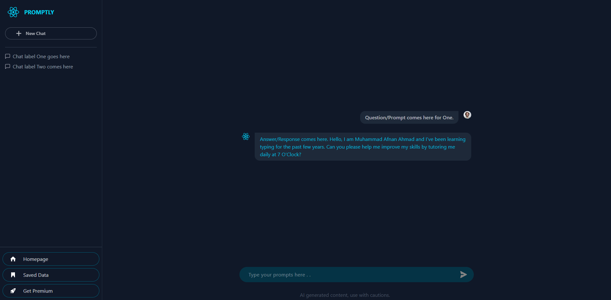

# Promptly

`Simplified version of ChatGPT Web Application`



A free prompts-based chat platform uses Artificial Intelligence via popular API's in background.

Currently, under development. Feel free to check it out on your own regards. For more stable outputs, see:

- [ChatGPT](https://chatgpt.com) uses [OpenAI Models](https://openai.com)
- [Grok](https://grok.com) uses [Twitter/X Data Models](https://x.com)

## Contributions

Any suggestions, PRs and collaborations are highly encouraged. For information on these topics, see [this documentation](https://docs.github.com/en).

## Installation

- Install [Node.js](https://nodejs.org/en/download) on your system
- Clone this repo

  ```git
  git clone https://github.com/OtakuTotipotent/promptly.git
  ```

- Start project

  ```cmd
  npm install

  npm run dev
  ```
